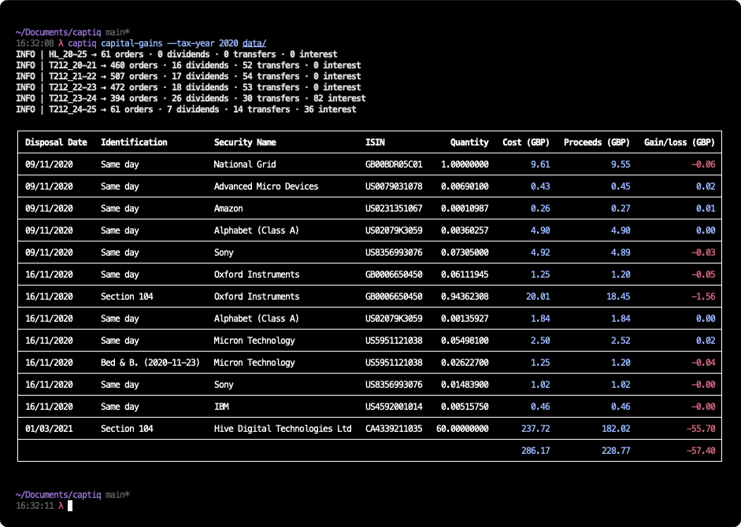

# Captiq

Captiq analyses account activity on share investment platforms to calculate UK Capital Gains Tax in accordance with HMRC share identification rules and provides information for the Capital Gains SA108 form in a Self Assessment tax return. Additionally, it provides options to view the allocation weight and unrealised gain/loss for open positions, share acquisitions and disposals, dividends paid out, interest on cash earned, and cash deposits or withdrawals. Captiq is based on [Investir](https://github.com/tacgomes/investir) by [Tiago Gomes](https://github.com/tacgomes).

## Installation and Usage

Before installing Captiq, consider using a virtual environment for the installation to avoid conflicts with other Python packages.

```sh
python -m venv .venv
source .venv/bin/activate
```

Clone the repository and install the `captiq` package:

```sh
git clone https://github.com/fraserlove/captiq.git
cd captiq
pip install .
```

Verify that `captiq` was installed successfully via `captiq --version`.

Shell completion is available for your shell and can be viewed with `captiq --show-completion` or installed with `captiq --install-completion`.

### Usage

Captiq processes data from CSV files exported from your investment platform. Currently, only _Trading 212_ is supported. You can provide individual CSV files or directories containing multiple CSV files. Captiq commands take the following form:

```sh
captiq [OPTIONS]... COMMAND [ARGS]... [FILES]...
```

- `OPTIONS` specify global options available for all commands, such as `--strict` to abort if data integrity issues are found, or `--verbose` to enable additional logging.
- `COMMAND` specifies the command to execute, such as `orders` to view share acquisitions and disposals.
- `ARGS` are command-specific options, such as `--acquisitions` to show only acquisitions.
- `FILES` are the CSV files or directories containing CSV files to process.

Use `captiq --help` or `captiq -h` to view available options and commands, or alternatively, `captiq COMMAND --help` or `captiq COMMAND -h` for command-specific information.

The `capital-gains` command generates a capital gains report. Other commands are available to view share `holdings`, market `orders` (acquisitions and disposals), `dividends` paid out, `transfers` (cash deposits or withdrawals), and `interest` earned.

If no `--tax-year` argument is provided, the current tax year is used.

## Example

Suppose you have a CSV file `T212.csv` containing your Trading 212 account activity. A capital gains report can be generated as follows:



## Additional Information

Share sub-divisions and consolidations are supported and detected automatically via the [Yahoo Finance API](https://pypi.org/project/yfinance/), however spin-off events (de-mergers) are not currently supported.

No special handling of accumulation shares in investment funds (where dividends or interest are automatically reinvested) is currently supported. This may result in different tax implications than what is reported.

Multi-currency accounts in Trading 212 are partially supported. It is possible to view orders, dividends, interest and transfers whose total is not in pound sterling, but it is not possible to calculate capital gains tax at the moment.

## Disclaimer

The information provided by Captiq might be inaccurate or simply not correct for your specific circumstances. Use the software at your own risk and always seek advice from a professional accountant before submitting your Self-Assessment tax return.

## License

Captiq is licensed under the MIT License. See the [LICENSE](LICENSE) file for more details.